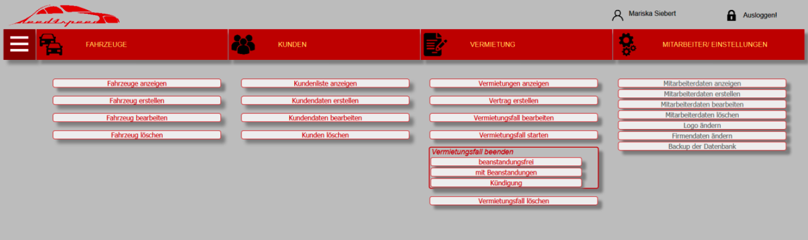
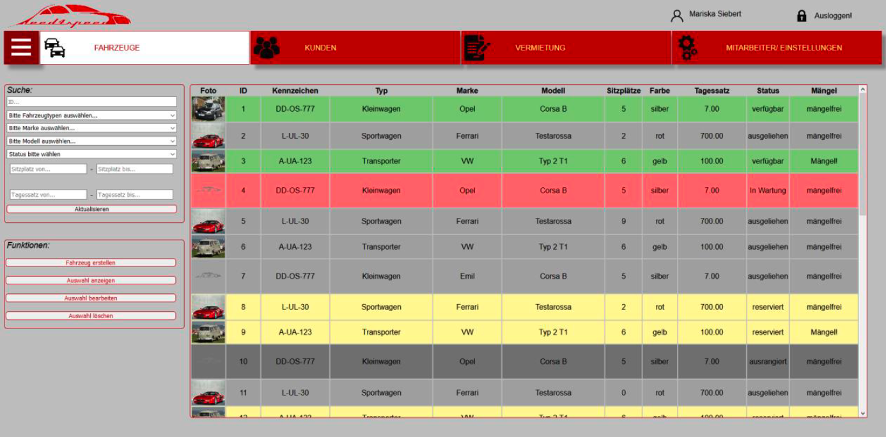
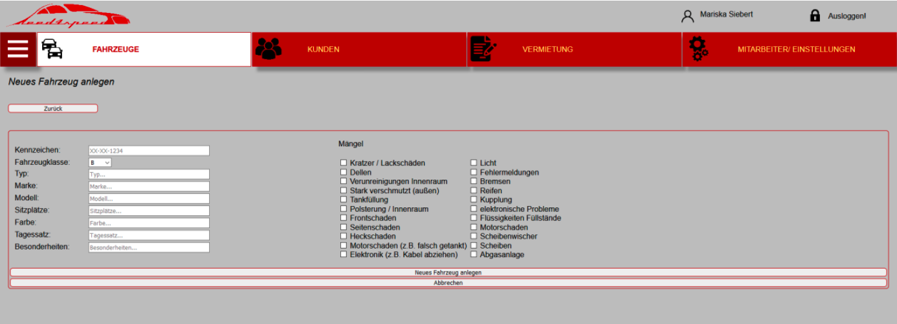
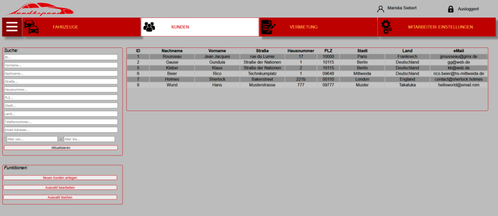

# restful-api

Custom API and Auth Service for Rental Software built from Felix Hildebrandt as final thesis for Software Engineering in 2020.
It also features a SQL and Postman architecture for test and build purposes.

> **_NOTE:_** The commentary and filenames might appear in German.

## Description

The API was the backend for a car rental service that ran within the browser (HTML+PHP) and Mobile (iOS)

## Screenshots

## Tools

[MySQL](https://www.mysql.com/)

[Postman](https://www.postman.com/)